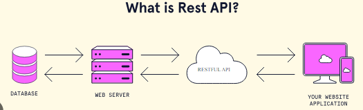
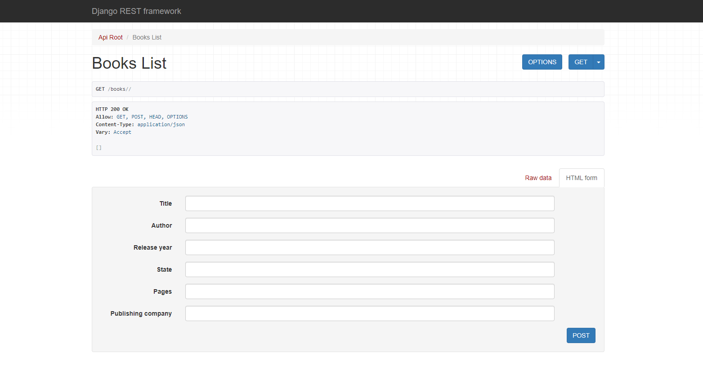
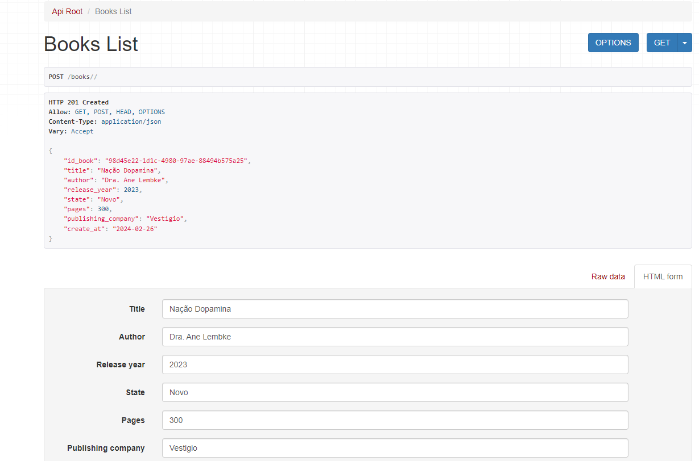

## CONTRUÇÃO DE UMA RESTFULLL API COM FRAMEWORK DJANGO
Iniciei um desafio neste começo da semana em estudar sobre WEBAPI usando Django, até o momento só havia usado o flask para construir API, nunca havia me colocado em aprender sobre API usando DJANGO FRAMEWORK, já, que no meu ponto de vista é um framework bastante organizado e facilita bastante na questão de ter uma estrutura de  pastas muito bem organizada no ambiente de trabalho achei interessante 🥰 .

Aqui, vamos entender o que é uma WEBAPI, por definição as WEBAPI são  pontos de acessos para web através de protocolos HTTP que possibilitam a conexão e comunicação entre o usuário e a API. 
Um exemplo  que é bastante usado , é sobre um restaurante, aonde a internet está funcionado como de fosse um garçom que vai fazendo a intermediação na comunicação entre o cliente e a cozinha. 

* [Descrição do Projeto](#descrição-do-projeto)

Aprender sobre WEBAPI  busquei alguns cursos e tutorias que pudessem me orientar a respeito da construção de uma WEBAPI. E para esta WEBAPI estou fazendo a inclusão de livros e autores com a suas respectivas imagens da capa, com o principal objetivo de entender quais mecanismos podem ser explorados quando se construí uma WEBPI que não é apenas argumentos textuais mais também podem ser incluídos medias como por exemplo(video, imagem, audio), nestes recuros por agora não explorei todos mais só fiquei apenas na inclusão de imagens para WEBAPI. 

* [Tecnologias utilizadas](#tecnologias-utilizadas)
 - Python3.11.3
 - MySQL
 - Servidor XAMP
 - Django Framework

* `Tecnologias utilizadas`: Funcionalidades do projeto

- `Funcionalidade 1`: Criar ambiente virtual
- `Funcionalidade 2`: Instalar as dependências
- `Funcionalidade 2a`: salvar todas as dependências no arquivo requirements.txt
- `Funcionalidade 2a`: Instalar o projeto e o seu respectivo aplicativo e indicar o nome
- `Funcionalidade 2a`: incluir o banco de dados no meu caso usei o MySQL

* [Tecnologias utilizadas](#tecnologias-utilizadas)

Estes foram os resultados obtidos.

* [Conclusão](#conclusão)

Minha primeira experiência em construir uma WEBAPI usando o Framework Django foi bastante interessante, espero manter esta regularidade dos estudos de modo a ter mais proeficiencia na construção de pequenos e até medios projetos que necessitam consturir uma WEBAPI. Uma maneira que sempre uso nos meus estudos é sobre a rebetibidade, isto me ajuda bastante a manter o conteúdo na mente, no entanto vou manter esta repetibilidade para que eu me sente mais confortável possível.

# Autor:
By: Laurindo Dumba
